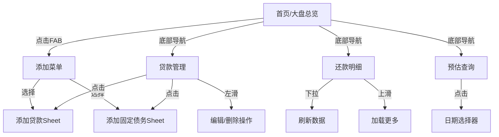

# 贷款还款计算器 - 移动端现代化PRD

## 1. 产品概述

一款专业的多笔贷款还款管理工具，采用现代化移动端App设计风格，提供流畅的触控交互体验。帮助用户清晰掌握总负债情况、还款进度，支持等额本息和等额本金两种还款方式。

目标用户：有房贷、车贷等多笔贷款的个人用户，主要在移动设备上管理还款计划。

## 2. 核心功能

### 2.1 用户角色

| 角色 | 注册方式 | 核心权限 |
|------|----------|----------|
| 普通用户 | 本地使用，无需注册 | 创建和管理贷款、查看还款计划、使用预估功能 |

### 2.2 功能模块

本应用包含以下主要页面：

1. **首页（大盘总览）**：展示总负债、总还款进度、每笔贷款概览及已还本金利息统计，采用移动端卡片式布局。
2. **贷款管理页**：添加/编辑/删除贷款，设置还款方式、利率、还款日等，采用底部Sheet弹窗交互。
3. **还款明细页**：查看每笔贷款的详细还款列表（已还和待还），支持横向滑动切换月份。
4. **预估查询页**：输入指定日期，展示每笔贷款在该日期的剩余额度，采用沉浸式结果展示。

### 2.3 页面详情

| 页面名称 | 模块名称 | 功能描述 |
|----------|----------|----------|
| 首页 | 顶部数据卡片区 | 采用大型数据卡片展示总负债、剩余本金、已还本金、已还利息，支持横向滑动查看。 |
| 首页 | 总体进度卡片 | 圆形进度环展示整体还款进度，中央显示百分比数字。 |
| 首页 | 贷款列表区 | 垂直卡片列表，每张卡片展示贷款名称、进度条、剩余本金、月供、下次还款日，支持左滑删除。 |
| 首页 | 固定债务区 | 折叠面板展示固定债务列表，点击展开查看详情。 |
| 首页 | 底部悬浮按钮 | 固定在右下角的圆形悬浮按钮（FAB），点击展开添加菜单（添加贷款、添加固定债务）。 |
| 贷款管理页 | 顶部Tab切换 | 滑动切换"贷款"和"固定债务"两个标签页。 |
| 贷款管理页 | 贷款卡片列表 | 垂直排列的卡片，左滑显示编辑/删除操作，点击进入详情。 |
| 贷款管理页 | 添加贷款表单 | 从底部滑出的Sheet面板，分步骤表单：基本信息 → 利率设置 → 提前还款。 |
| 贷款管理页 | 添加固定债务表单 | 底部Sheet面板，简洁的输入表单。 |
| 还款明细页 | 贷款选择器 | 顶部下拉选择贷款，支持下拉刷新。 |
| 还款明细页 | 还款计划卡片列表 | 采用时间轴卡片展示每期还款，已还/待用不同颜色区分，支持无限滚动加载。 |
| 还款明细页 | 筛选标签 | 顶部横向滚动的筛选标签：全部、已还、待还。 |
| 预估查询页 | 日期选择器 | 全屏日期选择器，支持快速选择常用日期（1年后、3年后、5年后）。 |
| 预估查询页 | 预估结果卡片 | 大型结果卡片展示总负债，下方列表展示每笔贷款预估详情。 |
| 预估查询页 | 数据可视化 | 使用环形图展示负债构成（贷款 vs 固定债务）。 |

## 3. 核心流程

### 3.1 用户使用流程

用户首次打开App进入首页，看到总览数据。点击右下角悬浮按钮展开菜单，选择添加贷款进入表单流程。填写完成后返回首页查看更新数据。左右滑动底部导航栏切换页面，在还款明细页查看详细列表，在预估查询页选择日期查看未来负债情况。

### 3.2 页面导航流程图



## 4. 用户界面设计

### 4.1 设计风格

- **设计系统**：采用现代移动端设计语言，类似iOS/Android原生App风格
- **主色调**：
  - 主色：深蓝色 `#1e3a5f`（品牌色、导航栏）
  - 强调色：活力橙 `#f5a623`（按钮、高亮、进度）
  - 成功色：翠绿 `#34c759`（已还、正向数据）
  - 警告色：琥珀 `#ff9500`（待还、提醒）
  - 背景色：浅灰 `#f2f2f7`（页面背景）
  - 卡片色：纯白 `#ffffff`（卡片背景）
- **圆角系统**：
  - 小圆角：8px（按钮、输入框）
  - 中圆角：12px（小卡片）
  - 大圆角：16px（大卡片、Sheet）
  - 全圆角：50%（FAB按钮、标签）
- **字体**：系统默认字体（iOS: SF Pro / Android: Roboto）
  - 大标题：28-32px，粗体
  - 标题：20-24px，半粗
  - 正文：16-17px，常规
  - 辅助文字：13-14px，常规，灰色
  - 数据数字：24-36px，等宽字体，粗体
- **阴影系统**：
  - 小阴影：`0 2px 8px rgba(0,0,0,0.08)`（卡片）
  - 中阴影：`0 4px 16px rgba(0,0,0,0.12)`（悬浮按钮、Sheet）
  - 大阴影：`0 8px 32px rgba(0,0,0,0.16)`（模态框）
- **图标风格**：使用 Lucide 图标库，线性风格，2px描边

### 4.2 页面设计概览

| 页面名称 | 模块名称 | UI元素 |
|----------|----------|--------|
| 首页 | 顶部Header | 固定顶部，显示App名称和设置图标，背景使用主色渐变。 |
| 首页 | 数据卡片轮播 | 横向可滑动的卡片容器，每张卡片展示一个核心指标，大号数字显示，卡片带有微动效。 |
| 首页 | 进度环形图 | 中央放置圆形进度环，内圈显示百分比，外圈显示已还/剩余比例，使用渐变色填充。 |
| 首页 | 贷款列表 | 垂直堆叠的卡片，圆角16px，白色背景，卡片内包含：名称、标签、进度条、关键数据。 |
| 首页 | 悬浮按钮(FAB) | 右下角56px圆形按钮，橙色背景，白色加号图标，点击展开扇形菜单。 |
| 首页 | 底部导航栏 | 固定底部，4个Tab图标（首页、贷款、明细、预估），选中状态高亮并上浮。 |
| 贷款管理页 | 顶部Segment | 居中放置的滑动切换控件，圆角胶囊形状，选中项填充主色。 |
| 贷款管理页 | 贷款卡片 | 左滑显示操作按钮（编辑/删除），卡片带有触摸反馈（按压缩小效果）。 |
| 贷款管理页 | 空状态 | 居中插图+文字提示，引导用户添加第一条数据。 |
| 贷款管理页 | Sheet面板 | 从底部滑出的面板，圆角顶部（20px），带拖拽指示条，内部表单分步骤展示。 |
| 还款明细页 | 顶部选择器 | 下拉式贷款选择器，带搜索功能，显示当前贷款缩略信息。 |
| 还款明细页 | 筛选标签栏 | 横向滚动的标签，选中项有底部指示条，支持左右滑动切换。 |
| 还款明细页 | 时间轴卡片 | 左侧时间线连接各卡片，已还节点为绿色实心，待还为灰色空心。 |
| 还款明细页 | 月份分组 | 按年份分组，粘性头部显示年份。 |
| 预估查询页 | 日期选择区 | 大号的日期显示，点击弹出全屏日历选择器，下方快捷按钮（1年后、3年后、5年后）。 |
| 预估查询页 | 查询按钮 | 全宽大号按钮，橙色渐变背景，圆角12px，带加载状态。 |
| 预估查询页 | 结果展示区 | 顶部大图卡片展示总负债，下方环形图展示构成，再下方列表展示明细。 |

### 4.3 响应式设计

- **移动端优先**：默认适配 375px-428px 宽度的手机屏幕
- **大屏适配**：
  - 平板（768px+）：内容区居中，最大宽度600px，保持移动端布局
  - 桌面端（1024px+）：内容区居中，最大宽度414px，模拟手机界面
- **触控优化**：
  - 所有可点击元素最小 44x44px 触控区域
  - 按钮添加按压态（scale 0.97）
  - 列表项支持左滑操作
  - 支持下拉刷新、上滑加载
  - 页面切换使用滑动动画

### 4.4 动画与交互

- **页面转场**：使用滑动过渡动画，从右向左进入，从左向右返回
- **卡片动效**：
  - 入场：从下方淡入上移，带轻微弹性
  - 按压：scale 0.98，背景色加深
  - 删除：向左滑出，高度收缩
- **悬浮按钮**：
  - 点击展开：扇形展开子按钮，带弹性动画
  - 子按钮：依次出现，间隔50ms
- **进度环**：数字从0动画增长到目标值，环形进度同步填充
- **数据更新**：数字变化时使用计数动画
- **加载状态**：骨架屏占位，避免布局跳动
- **下拉刷新**：顶部弹性拉伸，释放后显示加载指示器

## 5. 计算规则说明

### 5.1 等额本息计算公式

每月还款额 = [贷款本金 × 月利率 × (1+月利率)^还款月数] ÷ [(1+月利率)^还款月数 - 1]

每月利息 = 剩余本金 × 月利率
每月本金 = 每月还款额 - 每月利息

### 5.2 等额本金计算公式

每月本金 = 贷款本金 ÷ 还款月数
每月利息 = 剩余本金 × 月利率
每月还款额 = 每月本金 + 每月利息

### 5.3 利率变更处理

利率变更时，以变更日期为分界点：
1. 变更前按原利率计算
2. 从变更生效日起，按新利率重新计算剩余期数的还款计划
3. 剩余本金保持不变，重新计算月供

### 5.4 提前还款处理

提前还款时，用户选择还款类型：
- **缩短期限**：月供不变，重新计算可缩短的期数
- **减少月供**：期数不变，重新计算每月还款额

### 5.5 固定债务说明

固定债务是一种特殊类型的债务，特点如下：
- **无需每月还款**：不需要按月偿还，没有还款计划
- **金额固定**：债务金额在创建时确定，不会随时间变化
- **全额计入负债**：债务金额全额计入总负债
- **预估时保持不变**：在预估查询时，固定债务金额保持不变（除非用户手动修改）

## 6. 部署需求

### 6.1 Docker 部署

- **容器化**：应用需要打包为 Docker 镜像
- **轻量级数据库**：使用 SQLite 作为数据库存储方案
- **单容器部署**：前端静态文件由 Nginx 服务，后端 API 和数据库在同一容器内运行
- **数据持久化**：通过 Docker Volume 持久化 SQLite 数据库文件

### 6.2 部署架构

```
┌─────────────────────────────────────┐
│         Docker Container            │
│  ┌─────────────┐  ┌──────────────┐ │
│  │   Nginx     │  │  Node.js API │ │
│  │  (静态文件)  │  │   (后端服务)  │ │
│  └─────────────┘  └──────────────┘ │
│         │                │         │
│  ┌────────────────────────────────┐ │
│  │         SQLite 数据库           │ │
│  └────────────────────────────────┘ │
└─────────────────────────────────────┘
```

### 6.3 环境要求

- Docker Engine 20.10+
- Docker Compose 2.0+ (可选，用于编排)
- 内存：最低 256MB，推荐 512MB
- 存储：根据数据量，最低 100MB
