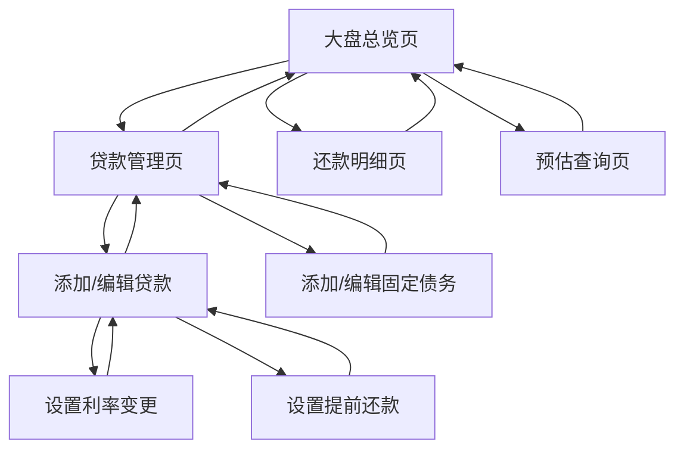

# 贷款还款计算器 - 产品需求文档 (PRD)

## 1. 产品概述

一款专业的多笔贷款还款管理工具，帮助用户清晰掌握总负债情况、还款进度，支持等额本息和等额本金两种还款方式，可灵活设置利率变更、提前还款等复杂场景。支持 Docker 容器化部署，使用轻量级数据库存储数据。

目标用户：有房贷、车贷等多笔贷款的个人用户，需要统一管理还款计划、预估未来负债。

## 2. 核心功能

### 2.1 用户角色

| 角色 | 注册方式 | 核心权限 |
|------|----------|----------|
| 普通用户 | 本地使用，无需注册 | 创建和管理贷款、查看还款计划、使用预估功能 |

### 2.2 功能模块

本应用包含以下主要页面：

1. **大盘总览页**：展示总负债、总还款进度、每笔贷款概览及已还本金利息统计。
2. **贷款管理页**：添加/编辑/删除贷款，设置还款方式、利率、还款日等。
3. **还款明细页**：查看每笔贷款的详细还款列表（已还和待还）。
4. **预估查询页**：输入指定日期，展示每笔贷款在该日期的剩余额度。

### 2.3 页面详情

| 页面名称 | 模块名称 | 功能描述 |
|----------|----------|----------|
| 大盘总览页 | 总负债卡片 | 展示所有贷款的剩余本金总和，实时计算更新。 |
| 大盘总览页 | 还款进度卡片 | 展示整体还款进度百分比（已还本金/总本金），带进度条可视化。 |
| 大盘总览页 | 贷款列表概览 | 列表展示每笔贷款：名称、剩余本金、还款进度、月供金额、下次还款日。 |
| 大盘总览页 | 固定债务卡片 | 展示固定债务总额和明细列表。 |
| 大盘总览页 | 已还统计卡片 | 统计并展示：已还本金总额、已还利息总额、累计还款总额。 |
| 贷款管理页 | 贷款列表 | 展示所有贷款卡片，支持点击进入编辑或删除。 |
| 贷款管理页 | 固定债务列表 | 展示固定债务卡片，支持添加/编辑/删除。 |
| 贷款管理页 | 添加贷款表单 | 输入贷款名称、贷款总额、贷款期限（月）、还款方式（等额本息/等额本金）、初始利率、首次还款日、每月还款日。 |
| 贷款管理页 | 添加固定债务表单 | 输入债务名称、债务金额、债务说明、债务日期。 |
| 贷款管理页 | 利率变更设置 | 为每笔贷款添加多段利率：设置利率生效起始日期、利率值，系统自动计算变更后的还款计划。 |
| 贷款管理页 | 提前还款设置 | 为每笔贷款添加提前还款记录：还款日期、还款金额、还款类型（缩短期限/减少月供），重新计算后续还款计划。 |
| 还款明细页 | 还款计划表 | 以表格形式展示每笔贷款的还款明细：期数、还款日期、月供金额、本金部分、利息部分、剩余本金。 |
| 还款明细页 | 筛选与切换 | 支持按贷款筛选查看，支持切换"已还"和"待还"标签页。 |
| 还款明细页 | 已还标记 | 已过去的还款日期自动标记为"已还"，未来的标记为"待还"。 |
| 预估查询页 | 日期选择器 | 用户选择或输入目标日期。 |
| 预估查询页 | 预估结果列表 | 展示每笔贷款在目标日期的剩余本金、剩余期数、预计结清日期。 |
| 预估查询页 | 固定债务预估 | 展示固定债务在目标日期的剩余金额。 |
| 预估查询页 | 总负债预估 | 汇总展示目标日期的总剩余负债（贷款+固定债务）。 |

## 3. 核心流程

### 3.1 用户使用流程

用户首次使用应用时，进入大盘总览页（初始状态为空）。用户点击"添加贷款"进入贷款管理页，填写贷款基本信息后保存。系统根据还款方式和利率自动计算还款计划。用户可随时添加利率变更或提前还款记录，系统重新计算后续还款计划。用户可在大盘总览页查看整体负债情况，在还款明细页查看详细列表，在预估查询页输入日期查看未来负债。

用户也可以添加固定债务，这类债务不需要每月还款，只需记录债务金额和相关信息，在总负债中统一展示。

### 3.2 页面导航流程图



## 4. 用户界面设计

### 4.1 设计风格

- **主色调**：深蓝色 (#1e3a5f) 作为主色，象征稳重与信任；橙色 (#f5a623) 作为强调色，用于关键数据和操作按钮。
- **按钮样式**：圆角矩形（border-radius: 8px），主要操作按钮使用橙色渐变，次要按钮使用浅灰色。
- **字体**：系统默认字体，标题 18-24px，正文 14-16px，数据展示使用等宽字体便于对齐。
- **布局风格**：卡片式布局，顶部导航栏固定，内容区域采用响应式网格布局。
- **图标风格**：使用线性图标（outline style），保持简洁统一。

### 4.2 页面设计概览

| 页面名称 | 模块名称 | UI元素 |
|----------|----------|--------|
| 大盘总览页 | 顶部数据卡片区 | 4 个等宽卡片横向排列：总负债（大号蓝色数字）、总进度（环形进度图）、固定债务（金额展示）、已还统计（本金/利息两行）。 |
| 大盘总览页 | 贷款列表区 | 卡片列表，每张卡片展示贷款名称、进度条、剩余本金、月供、下次还款日，卡片带悬停阴影效果。 |
| 大盘总览页 | 固定债务区 | 固定债务列表卡片，展示债务名称、金额、说明。 |
| 大盘总览页 | 底部操作栏 | 固定在底部的快捷操作按钮：添加贷款、添加固定债务、查看明细、预估查询。 |
| 贷款管理页 | 贷款卡片列表 | 垂直排列的卡片，每张卡片顶部显示贷款名称和还款方式标签，中部显示核心参数，底部有编辑/删除按钮。 |
| 贷款管理页 | 固定债务卡片列表 | 垂直排列的卡片，显示债务名称、金额、日期、说明，底部有编辑/删除按钮。 |
| 贷款管理页 | 添加/编辑贷款表单 | 模态弹窗或侧边抽屉形式，分步骤：基本信息 → 利率设置 → 提前还款，底部有上一步/下一步/保存按钮。 |
| 贷款管理页 | 添加/编辑固定债务表单 | 模态弹窗，输入债务名称、金额、日期、说明，底部有保存/取消按钮。 |
| 还款明细页 | 筛选栏 | 顶部下拉选择器选择贷款，标签页切换"已还"/"待还"/"全部"。 |
| 还款明细页 | 数据表格 | 固定表头，表格行斑马纹，已还行灰色背景，待还行白色背景，金额列右对齐。 |
| 预估查询页 | 查询区 | 居中的日期选择器，大号的"查询"按钮（橙色）。 |
| 预估查询页 | 结果展示区 | 与大盘总览页类似的卡片列表展示每笔贷款预估结果，底部汇总卡片突出显示，包含固定债务。 |

### 4.3 响应式设计

- **桌面端优先**：默认适配 1280px 以上宽屏，三列卡片布局。
- **平板适配**：768px-1279px 时变为两列布局，表格横向滚动。
- **手机适配**：768px 以下变为单列布局，底部导航变为汉堡菜单，表格转为卡片列表展示。
- **触控优化**：按钮最小点击区域 44x44px，支持手势滑动切换页面。

## 5. 计算规则说明

### 5.1 等额本息计算公式

每月还款额 = [贷款本金 × 月利率 × (1+月利率)^还款月数] ÷ [(1+月利率)^还款月数 - 1]

每月利息 = 剩余本金 × 月利率
每月本金 = 每月还款额 - 每月利息

### 5.2 等额本金计算公式

每月本金 = 贷款本金 ÷ 还款月数
每月利息 = 剩余本金 × 月利率
每月还款额 = 每月本金 + 每月利息

### 5.3 利率变更处理

利率变更时，以变更日期为分界点：
1. 变更前按原利率计算
2. 从变更生效日起，按新利率重新计算剩余期数的还款计划
3. 剩余本金保持不变，重新计算月供

### 5.4 提前还款处理

提前还款时，用户选择还款类型：
- **缩短期限**：月供不变，重新计算可缩短的期数
- **减少月供**：期数不变，重新计算每月还款额

### 5.5 固定债务说明

固定债务是一种特殊类型的债务，特点如下：
- **无需每月还款**：不需要按月偿还，没有还款计划
- **金额固定**：债务金额在创建时确定，不会随时间变化
- **全额计入负债**：债务金额全额计入总负债
- **预估时保持不变**：在预估查询时，固定债务金额保持不变（除非用户手动修改）

## 6. 部署需求

### 6.1 Docker 部署

- **容器化**：应用需要打包为 Docker 镜像
- **轻量级数据库**：使用 SQLite 作为数据库存储方案
- **单容器部署**：前端静态文件由 Nginx 服务，后端 API 和数据库在同一容器内运行
- **数据持久化**：通过 Docker Volume 持久化 SQLite 数据库文件

### 6.2 部署架构

```
┌─────────────────────────────────────┐
│         Docker Container            │
│  ┌─────────────┐  ┌──────────────┐ │
│  │   Nginx     │  │  Node.js API │ │
│  │  (静态文件)  │  │   (后端服务)  │ │
│  └─────────────┘  └──────────────┘ │
│         │                │         │
│  ┌────────────────────────────────┐ │
│  │         SQLite 数据库           │ │
│  └────────────────────────────────┘ │
└─────────────────────────────────────┘
```

### 6.3 环境要求

- Docker Engine 20.10+
- Docker Compose 2.0+ (可选，用于编排)
- 内存：最低 256MB，推荐 512MB
- 存储：根据数据量，最低 100MB
