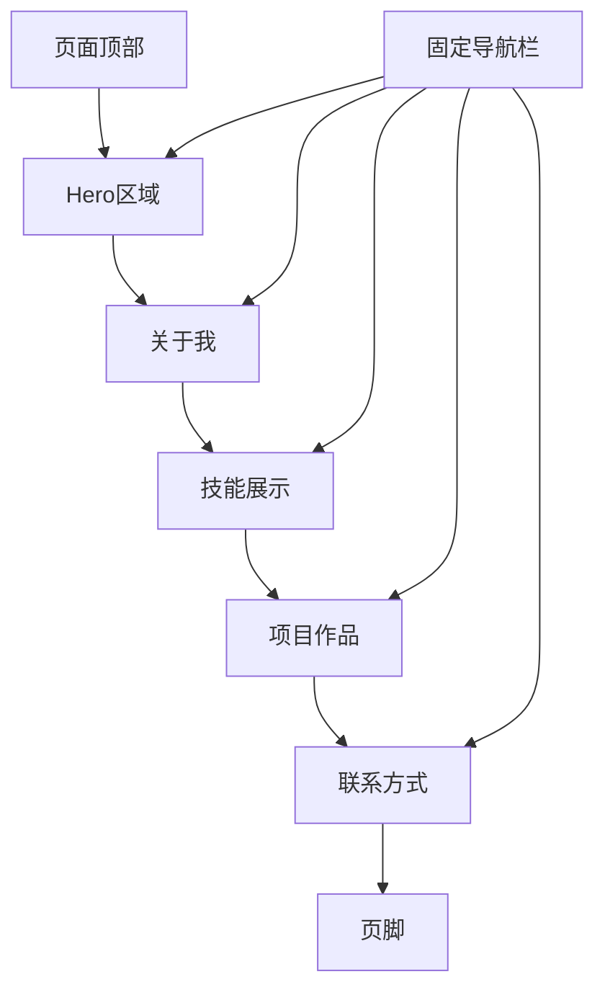

## 1. 产品概述

个人主页是一个展示个人信息、技能和作品的现代化单页网站，帮助用户建立个人品牌形象并展示专业能力。

## 2. 核心功能

### 2.1 用户角色

| 角色  | 注册方式 | 核心权限         |
| --- | ---- | ------------ |
| 访客  | 无需注册 | 浏览个人主页所有公开内容 |
| 管理员 | 本地配置 | 编辑和更新个人主页内容  |

### 2.2 功能模块

个人主页包含以下主要页面：

1. **首页（单页应用）**：包含Hero区域、关于我、技能展示、项目作品、联系方式等核心模块。

### 2.3 页面详情

| 页面名称 | 模块名称   | 功能描述                         |
| ---- | ------ | ---------------------------- |
| 首页   | Hero区域 | 展示个人头像、姓名、职业头衔、简短介绍，包含背景动画效果 |
| 首页   | 关于我    | 展示个人简介、教育背景、工作经历，支持时间线展示     |
| 首页   | 技能展示   | 以可视化方式展示技术栈和技能熟练度，支持进度条或标签云  |
| 首页   | 项目作品   | 展示个人项目作品集，包含项目图片、描述、技术栈和链接   |
| 首页   | 联系方式   | 展示邮箱、社交媒体链接，包含联系表单供访客留言      |
| 首页   | 页脚     | 版权信息、快速导航链接                  |

## 3. 核心流程

### 访客浏览流程

访客进入个人主页后，可以按顺序浏览各个模块：

1. 首先看到Hero区域，了解个人基本信息
2. 滚动查看"关于我"模块，了解详细背景
3. 浏览技能展示，了解技术能力
4. 查看项目作品，了解实际成果
5. 通过联系方式模块与主人取得联系

### 导航流程

## 4. 用户界面设计

### 4.1 设计风格

* **主色调**：深色主题（#1a1a2e）配合亮色强调（#e94560）

* **次要色**：中性灰色（#16213e, #0f3460）

* **按钮样式**：圆角矩形，悬停时有渐变或阴影效果

* **字体**：标题使用无衬线字体（如Inter或Poppins），正文使用易读字体

* **字体大小**：Hero标题48-64px，模块标题32px，正文16-18px

* **布局风格**：单页滚动布局，固定顶部导航，全宽区块设计

* **图标风格**：使用Lucide或Heroicons线性图标，简洁现代

### 4.2 页面设计概述

| 页面名称 | 模块名称   | UI元素                                                 |
| ---- | ------ | ---------------------------------------------------- |
| 首页   | Hero区域 | 全屏高度，渐变或粒子动画背景，居中头像（150px圆形），大号姓名标题，打字机效果副标题，向下滚动指示器 |
| 首页   | 关于我    | 左右分栏布局，左侧个人照片，右侧文字介绍，时间线展示经历，卡片式悬浮效果                 |
| 首页   | 技能展示   | 网格布局展示技能卡片，进度条显示熟练度，悬停放大效果，分类标签（前端/后端/工具）            |
| 首页   | 项目作品   | 卡片网格布局（2-3列），项目截图占位，技术栈标签，悬停显示项目详情和链接按钮              |
| 首页   | 联系方式   | 分栏布局，左侧联系信息列表（邮箱、GitHub、LinkedIn），右侧联系表单（姓名、邮箱、留言）   |
| 首页   | 页脚     | 简洁设计，版权文字，返回顶部按钮                                     |

### 4.3 响应式设计

* **桌面优先**：默认设计为桌面端（1200px+）

* **平板适配**：中等屏幕（768px-1199px）调整网格为2列

* **移动端适配**：小屏幕（<768px）单列布局，导航变为汉堡菜单

* **触摸优化**：按钮和链接点击区域不小于44px，支持触摸滑动

### 4.4 动画效果

* **页面加载**：渐入动画，元素依次出现

* **滚动动画**：元素进入视口时触发淡入或滑入动画

* **悬停效果**：卡片悬浮、按钮颜色变化、链接下划线动画

* **Hero背景**：粒子动画或渐变流动效果

