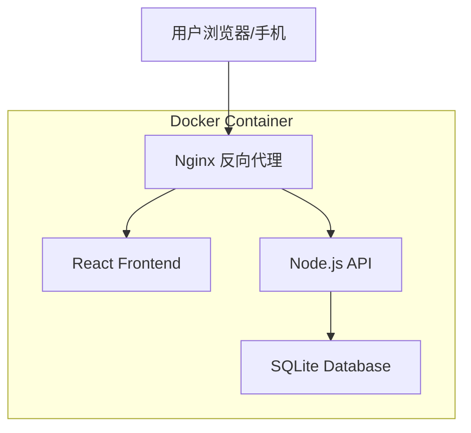

# 贷款还款计算器 - 移动端技术架构文档

## 1. 架构设计



## 2. 技术描述

### 2.1 前端技术栈

- **框架**: React@18 + TypeScript
- **样式**: TailwindCSS@3 + 自定义移动端适配
- **构建工具**: Vite
- **状态管理**: Zustand
- **路由**: React Router DOM
- **动画库**: Framer Motion（页面转场、手势交互、动画效果）
- **图表库**: Recharts（环形进度图、数据可视化）
- **日期处理**: date-fns
- **HTTP 客户端**: Axios
- **图标**: Lucide React
- **手势支持**: Framer Motion（拖拽、滑动、捏合）

### 2.2 后端技术栈

- **运行时**: Node.js 20 + TypeScript
- **框架**: Express.js
- **数据库**: SQLite3 (better-sqlite3)
- **ORM**: 原生 SQL (轻量级)
- **构建**: tsc

### 2.3 部署方案

- **容器化**: Docker
- **Web 服务器**: Nginx
- **数据持久化**: Docker Volume

## 3. 路由定义

### 3.1 前端路由

| 路由 | 用途 |
|------|------|
| / | 首页/大盘总览，展示总负债、还款进度、贷款列表概览 |
| /loans | 贷款管理页，添加/编辑/删除贷款和固定债务 |
| /details | 还款明细页，查看每笔贷款的详细还款列表 |
| /forecast | 预估查询页，输入日期查询每笔贷款剩余额度 |

### 3.2 后端 API 路由

| 路由 | 方法 | 用途 |
|------|------|------|
| /api/loans | GET | 获取所有贷款列表 |
| /api/loans | POST | 创建新贷款 |
| /api/loans/:id | GET | 获取单个贷款详情 |
| /api/loans/:id | PUT | 更新贷款信息 |
| /api/loans/:id | DELETE | 删除贷款 |
| /api/loans/:id/schedule | GET | 获取贷款还款计划 |
| /api/loans/:id/rate-changes | POST | 添加利率变更 |
| /api/loans/:id/prepayments | POST | 添加提前还款 |
| /api/fixed-debts | GET | 获取所有固定债务 |
| /api/fixed-debts | POST | 创建固定债务 |
| /api/fixed-debts/:id | PUT | 更新固定债务 |
| /api/fixed-debts/:id | DELETE | 删除固定债务 |
| /api/dashboard | GET | 获取大盘数据 |
| /api/forecast | GET | 获取预估数据 |

## 4. 核心类型定义

### 4.1 共享类型 (shared/types.ts)

```typescript
// 还款方式
enum RepaymentMethod {
  EQUAL_INSTALLMENT = 'equal_installment',    // 等额本息
  EQUAL_PRINCIPAL = 'equal_principal'         // 等额本金
}

// 提前还款类型
enum PrepaymentType {
  REDUCE_TERM = 'reduce_term',     // 缩短期限
  REDUCE_PAYMENT = 'reduce_payment' // 减少月供
}

// 利率变更记录
interface RateChange {
  id: string;
  loanId: string;
  effectiveDate: string;  // 生效日期 YYYY-MM-DD
  annualRate: number;     // 年利率 (如 0.0435 表示 4.35%)
  createdAt: string;
}

// 提前还款记录
interface Prepayment {
  id: string;
  loanId: string;
  paymentDate: string;    // 还款日期 YYYY-MM-DD
  amount: number;         // 还款金额
  type: PrepaymentType;   // 还款类型
  createdAt: string;
}

// 贷款实体
interface Loan {
  id: string;
  name: string;                   // 贷款名称
  totalAmount: number;            // 贷款总额
  totalMonths: number;            // 贷款期限（月）
  method: RepaymentMethod;        // 还款方式
  firstPaymentDate: string;       // 首次还款日 YYYY-MM-DD
  paymentDay: number;             // 每月还款日 (1-31)
  initialRate: number;            // 初始年利率
  createdAt: string;
  updatedAt: string;
}

// 贷款完整信息（含关联数据）
interface LoanWithRelations extends Loan {
  rateChanges: RateChange[];
  prepayments: Prepayment[];
}

// 还款计划项
interface PaymentScheduleItem {
  period: number;                 // 期数
  paymentDate: string;            // 还款日期 YYYY-MM-DD
  monthlyPayment: number;         // 月供金额
  principal: number;              // 本金部分
  interest: number;               // 利息部分
  remainingPrincipal: number;     // 剩余本金
  isPaid: boolean;                // 是否已还
}

// 固定债务
interface FixedDebt {
  id: string;
  name: string;                   // 债务名称
  amount: number;                 // 债务金额
  description?: string;           // 债务说明
  debtDate: string;               // 债务日期 YYYY-MM-DD
  createdAt: string;
  updatedAt: string;
}

// 大盘总览数据
interface DashboardData {
  totalRemainingPrincipal: number;  // 总剩余本金（贷款）
  totalFixedDebt: number;           // 固定债务总额
  totalDebt: number;                // 总负债
  totalPaidPrincipal: number;       // 总已还本金
  totalPaidInterest: number;        // 总已还利息
  overallProgress: number;          // 整体还款进度
  loans: LoanSummary[];             // 各贷款摘要
  fixedDebts: FixedDebt[];          // 固定债务列表
}

// 贷款摘要
interface LoanSummary {
  id: string;
  name: string;
  remainingPrincipal: number;
  progress: number;
  monthlyPayment: number;
  nextPaymentDate: string | null;
  method: RepaymentMethod;
}

// 预估查询结果
interface ForecastResult {
  date: string;
  totalRemainingPrincipal: number;
  totalFixedDebt: number;
  totalDebt: number;
  loans: {
    loanId: string;
    loanName: string;
    remainingPrincipal: number;
    remainingPeriods: number;
    payoffDate: string;
  }[];
  fixedDebts: FixedDebt[];
}
```

## 5. 组件架构

### 5.1 移动端专用组件

```
frontend/src/
├── components/
│   ├── Layout/
│   │   ├── MobileLayout.tsx      # 移动端布局容器
│   │   ├── BottomNav.tsx         # 底部导航栏
│   │   ├── Header.tsx            # 顶部标题栏
│   │   └── SafeArea.tsx          # 安全区域适配
│   ├── UI/
│   │   ├── Card.tsx              # 卡片组件
│   │   ├── Button.tsx            # 按钮组件（含按压态）
│   │   ├── Sheet.tsx             # 底部Sheet面板
│   │   ├── FAB.tsx               # 悬浮按钮
│   │   ├── ProgressRing.tsx      # 环形进度
│   │   ├── SwipeableItem.tsx     # 可滑动列表项
│   │   ├── SegmentedControl.tsx  # 分段控制器
│   │   ├── Timeline.tsx          # 时间轴组件
│   │   └── Skeleton.tsx          # 骨架屏
│   ├── Dashboard/
│   │   ├── StatCarousel.tsx      # 数据轮播
│   │   ├── LoanCard.tsx          # 贷款卡片
│   │   ├── FixedDebtSection.tsx  # 固定债务折叠区
│   │   └── ProgressSection.tsx   # 进度展示区
│   ├── Loan/
│   │   ├── LoanForm.tsx          # 贷款表单（分步骤）
│   │   ├── FixedDebtForm.tsx     # 固定债务表单
│   │   └── LoanCardSwipeable.tsx # 可滑动贷款卡片
│   ├── Details/
│   │   ├── PaymentTimeline.tsx   # 还款时间轴
│   │   ├── FilterTabs.tsx        # 筛选标签
│   │   └── MonthGroup.tsx        # 月份分组
│   └── Forecast/
│       ├── DatePicker.tsx        # 日期选择器
│       ├── ResultCard.tsx        # 结果卡片
│       └── DebtChart.tsx         # 负债图表
├── pages/
│   ├── Dashboard.tsx
│   ├── LoanManager.tsx
│   ├── PaymentDetails.tsx
│   └── Forecast.tsx
├── hooks/
│   ├── useSwipe.ts               # 滑动手势
│   ├── usePullToRefresh.ts       # 下拉刷新
│   ├── useInfiniteScroll.ts      # 无限滚动
│   └── useAnimatedNumber.ts      # 数字动画
├── stores/
│   ├── dashboardStore.ts
│   ├── loanStore.ts
│   └── fixedDebtStore.ts
├── services/
│   └── api.ts
└── utils/
    ├── animations.ts             # 动画配置
    ├── format.ts
    └── date.ts
```

## 6. 动画配置

### 6.1 页面转场动画

```typescript
// 页面进入动画
const pageTransition = {
  initial: { opacity: 0, x: 100 },
  animate: { opacity: 1, x: 0 },
  exit: { opacity: 0, x: -100 },
  transition: { type: "spring", stiffness: 300, damping: 30 }
};

// 卡片入场动画
const cardStagger = {
  animate: {
    transition: {
      staggerChildren: 0.05
    }
  }
};

const cardItem = {
  initial: { opacity: 0, y: 20 },
  animate: { opacity: 1, y: 0 },
  transition: { type: "spring", stiffness: 400, damping: 25 }
};
```

### 6.2 交互动画

```typescript
// 按钮按压效果
const buttonTap = {
  scale: 0.97,
  transition: { duration: 0.1 }
};

// 悬浮按钮展开
const fabExpand = {
  initial: { scale: 0, opacity: 0 },
  animate: { scale: 1, opacity: 1 },
  exit: { scale: 0, opacity: 0 },
  transition: { type: "spring", stiffness: 400, damping: 25 }
};

// Sheet滑入
const sheetSlide = {
  initial: { y: "100%" },
  animate: { y: 0 },
  exit: { y: "100%" },
  transition: { type: "spring", damping: 25, stiffness: 300 }
};

// 数字计数动画
const countAnimation = {
  duration: 1,
  ease: "easeOut"
};
```

## 7. 数据库设计

### 7.1 数据库表结构

```sql
-- 贷款表
CREATE TABLE loans (
  id TEXT PRIMARY KEY,
  name TEXT NOT NULL,
  total_amount REAL NOT NULL,
  total_months INTEGER NOT NULL,
  method TEXT NOT NULL CHECK(method IN ('equal_installment', 'equal_principal')),
  first_payment_date TEXT NOT NULL,
  payment_day INTEGER NOT NULL CHECK(payment_day BETWEEN 1 AND 31),
  initial_rate REAL NOT NULL,
  created_at TEXT NOT NULL,
  updated_at TEXT NOT NULL
);

-- 利率变更表
CREATE TABLE rate_changes (
  id TEXT PRIMARY KEY,
  loan_id TEXT NOT NULL,
  effective_date TEXT NOT NULL,
  annual_rate REAL NOT NULL,
  created_at TEXT NOT NULL,
  FOREIGN KEY (loan_id) REFERENCES loans(id) ON DELETE CASCADE
);

-- 提前还款表
CREATE TABLE prepayments (
  id TEXT PRIMARY KEY,
  loan_id TEXT NOT NULL,
  payment_date TEXT NOT NULL,
  amount REAL NOT NULL,
  type TEXT NOT NULL CHECK(type IN ('reduce_term', 'reduce_payment')),
  created_at TEXT NOT NULL,
  FOREIGN KEY (loan_id) REFERENCES loans(id) ON DELETE CASCADE
);

-- 固定债务表
CREATE TABLE fixed_debts (
  id TEXT PRIMARY KEY,
  name TEXT NOT NULL,
  amount REAL NOT NULL,
  description TEXT,
  debt_date TEXT NOT NULL,
  created_at TEXT NOT NULL,
  updated_at TEXT NOT NULL
);

-- 创建索引
CREATE INDEX idx_rate_changes_loan_id ON rate_changes(loan_id);
CREATE INDEX idx_rate_changes_effective_date ON rate_changes(effective_date);
CREATE INDEX idx_prepayments_loan_id ON prepayments(loan_id);
CREATE INDEX idx_prepayments_payment_date ON prepayments(payment_date);
```

### 7.2 数据库初始化

数据库文件路径: `/app/data/loans.db`

初始化脚本会在应用启动时自动执行，创建表结构和索引。

## 8. 响应式断点

```css
/* Tailwind 配置 */
module.exports = {
  theme: {
    screens: {
      'xs': '375px',      /* iPhone SE/mini */
      'sm': '414px',      /* iPhone Pro Max */
      'md': '768px',      /* iPad mini */
      'lg': '1024px',     /* iPad Pro */
    },
    extend: {
      maxWidth: {
        'mobile': '414px',
      },
      spacing: {
        'safe-top': 'env(safe-area-inset-top)',
        'safe-bottom': 'env(safe-area-inset-bottom)',
      }
    }
  }
}
```

## 9. 项目结构

### 9.1 整体目录结构

```
loan-calculator/
├── frontend/                 # 前端代码
│   ├── src/
│   │   ├── components/       # 组件
│   │   ├── pages/            # 页面
│   │   ├── hooks/            # 自定义 Hooks
│   │   ├── stores/           # Zustand 状态管理
│   │   ├── services/         # API 服务
│   │   ├── utils/            # 工具函数
│   │   └── styles/           # 全局样式
│   ├── public/
│   ├── index.html
│   ├── package.json
│   ├── tsconfig.json
│   ├── vite.config.ts
│   └── tailwind.config.js
├── backend/                  # 后端代码
│   ├── src/
│   │   ├── routes/           # API 路由
│   │   ├── services/         # 业务逻辑
│   │   ├── database/         # 数据库操作
│   │   └── index.ts
│   ├── package.json
│   └── tsconfig.json
├── shared/                   # 共享类型
│   └── types.ts
├── nginx/
│   └── default.conf
├── data/
├── Dockerfile
├── docker-compose.yml
└── .dockerignore
```

## 10. Docker 配置

### 10.1 Dockerfile

```dockerfile
# 构建阶段 - 前端
FROM node:20-alpine AS frontend-builder
WORKDIR /app/frontend
COPY frontend/package*.json ./
RUN npm ci
COPY frontend/ ./
RUN npm run build

# 构建阶段 - 后端
FROM node:20-alpine AS backend-builder
WORKDIR /app/backend
COPY backend/package*.json ./
RUN npm ci
COPY backend/ ./
RUN npm run build

# 生产阶段
FROM node:20-alpine AS production
WORKDIR /app

# 安装 Nginx
RUN apk add --no-cache nginx

# 复制后端构建产物
COPY --from=backend-builder /app/backend/dist ./backend
COPY --from=backend-builder /app/backend/node_modules ./backend/node_modules
COPY --from=backend-builder /app/backend/package.json ./backend/

# 复制前端构建产物
COPY --from=frontend-builder /app/frontend/dist /usr/share/nginx/html

# 复制 Nginx 配置
COPY nginx/default.conf /etc/nginx/http.d/default.conf

# 创建数据目录
RUN mkdir -p /app/data

# 暴露端口
EXPOSE 80

# 启动脚本
COPY docker-entrypoint.sh /app/
RUN chmod +x /app/docker-entrypoint.sh

ENTRYPOINT ["/app/docker-entrypoint.sh"]
```

### 10.2 docker-compose.yml

```yaml
version: '3.8'

services:
  loan-calculator:
    build: .
    ports:
      - "8080:80"
    volumes:
      - ./data:/app/data
    environment:
      - NODE_ENV=production
      - DB_PATH=/app/data/loans.db
    restart: unless-stopped
```

### 10.3 Nginx 配置

```nginx
server {
    listen 80;
    server_name localhost;
    root /usr/share/nginx/html;
    index index.html;

    # 前端静态文件
    location / {
        try_files $uri $uri/ /index.html;
    }

    # API 代理到后端
    location /api/ {
        proxy_pass http://localhost:3000/;
        proxy_http_version 1.1;
        proxy_set_header Upgrade $http_upgrade;
        proxy_set_header Connection 'upgrade';
        proxy_set_header Host $host;
        proxy_cache_bypass $http_upgrade;
    }
}
```

## 11. 部署说明

### 11.1 本地开发

```bash
# 启动后端
cd backend
npm install
npm run dev

# 启动前端
cd frontend
npm install
npm run dev
```

### 11.2 Docker 构建与运行

```bash
# 构建镜像
docker build -t loan-calculator .

# 运行容器
docker run -d \
  -p 8080:80 \
  -v $(pwd)/data:/app/data \
  --name loan-calculator \
  loan-calculator

# 或使用 Docker Compose
docker-compose up -d
```

### 11.3 数据备份

SQLite 数据库文件位于 `./data/loans.db`，可以通过以下方式备份：

```bash
# 复制数据库文件
cp data/loans.db backup/loans-$(date +%Y%m%d).db
```
