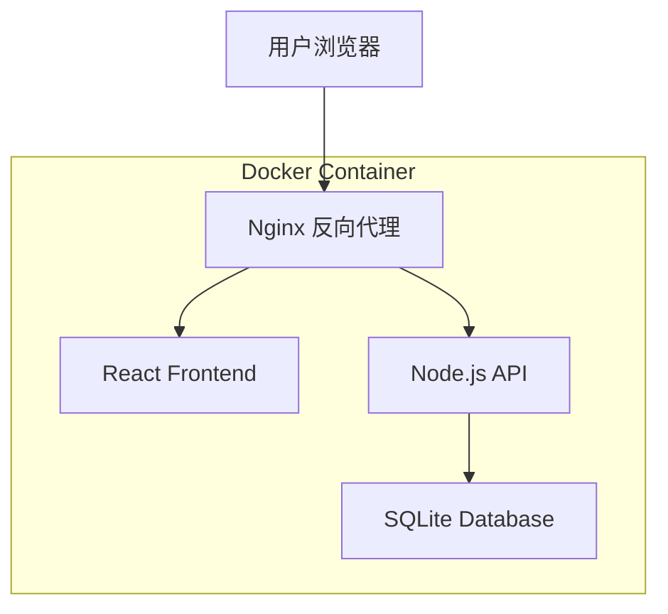

# 贷款还款计算器 - 技术架构文档

## 1. 架构设计



## 2. 技术描述

### 2.1 前端技术栈

- **框架**: React@18 + TypeScript
- **样式**: TailwindCSS@3
- **构建工具**: Vite
- **状态管理**: Zustand
- **路由**: React Router DOM
- **图表库**: Recharts (用于进度可视化)
- **日期处理**: date-fns
- **HTTP 客户端**: Axios

### 2.2 后端技术栈

- **运行时**: Node.js 20 + TypeScript
- **框架**: Express.js
- **数据库**: SQLite3 (better-sqlite3)
- **ORM**: 原生 SQL (轻量级)
- **构建**: tsc

### 2.3 部署方案

- **容器化**: Docker
- **Web 服务器**: Nginx
- **数据持久化**: Docker Volume

## 3. 路由定义

### 3.1 前端路由

| 路由 | 用途 |
|------|------|
| / | 大盘总览页，展示总负债、还款进度、贷款列表概览 |
| /loans | 贷款管理页，添加/编辑/删除贷款和固定债务 |
| /details | 还款明细页，查看每笔贷款的详细还款列表 |
| /forecast | 预估查询页，输入日期查询每笔贷款剩余额度 |

### 3.2 后端 API 路由

| 路由 | 方法 | 用途 |
|------|------|------|
| /api/loans | GET | 获取所有贷款列表 |
| /api/loans | POST | 创建新贷款 |
| /api/loans/:id | GET | 获取单个贷款详情 |
| /api/loans/:id | PUT | 更新贷款信息 |
| /api/loans/:id | DELETE | 删除贷款 |
| /api/loans/:id/schedule | GET | 获取贷款还款计划 |
| /api/loans/:id/rate-changes | POST | 添加利率变更 |
| /api/loans/:id/prepayments | POST | 添加提前还款 |
| /api/fixed-debts | GET | 获取所有固定债务 |
| /api/fixed-debts | POST | 创建固定债务 |
| /api/fixed-debts/:id | PUT | 更新固定债务 |
| /api/fixed-debts/:id | DELETE | 删除固定债务 |
| /api/dashboard | GET | 获取大盘数据 |
| /api/forecast | GET | 获取预估数据 |

## 4. 核心类型定义

### 4.1 共享类型 (shared/types.ts)

```typescript
// 还款方式
enum RepaymentMethod {
  EQUAL_INSTALLMENT = 'equal_installment',    // 等额本息
  EQUAL_PRINCIPAL = 'equal_principal'         // 等额本金
}

// 提前还款类型
enum PrepaymentType {
  REDUCE_TERM = 'reduce_term',     // 缩短期限
  REDUCE_PAYMENT = 'reduce_payment' // 减少月供
}

// 利率变更记录
interface RateChange {
  id: string;
  loanId: string;
  effectiveDate: string;  // 生效日期 YYYY-MM-DD
  annualRate: number;     // 年利率 (如 0.0435 表示 4.35%)
  createdAt: string;
}

// 提前还款记录
interface Prepayment {
  id: string;
  loanId: string;
  paymentDate: string;    // 还款日期 YYYY-MM-DD
  amount: number;         // 还款金额
  type: PrepaymentType;   // 还款类型
  createdAt: string;
}

// 贷款实体
interface Loan {
  id: string;
  name: string;                   // 贷款名称
  totalAmount: number;            // 贷款总额
  totalMonths: number;            // 贷款期限（月）
  method: RepaymentMethod;        // 还款方式
  firstPaymentDate: string;       // 首次还款日 YYYY-MM-DD
  paymentDay: number;             // 每月还款日 (1-31)
  initialRate: number;            // 初始年利率
  createdAt: string;
  updatedAt: string;
}

// 贷款完整信息（含关联数据）
interface LoanWithRelations extends Loan {
  rateChanges: RateChange[];
  prepayments: Prepayment[];
}

// 还款计划项
interface PaymentScheduleItem {
  period: number;                 // 期数
  paymentDate: string;            // 还款日期 YYYY-MM-DD
  monthlyPayment: number;         // 月供金额
  principal: number;              // 本金部分
  interest: number;               // 利息部分
  remainingPrincipal: number;     // 剩余本金
  isPaid: boolean;                // 是否已还
}

// 固定债务
interface FixedDebt {
  id: string;
  name: string;                   // 债务名称
  amount: number;                 // 债务金额
  description?: string;           // 债务说明
  debtDate: string;               // 债务日期 YYYY-MM-DD
  createdAt: string;
  updatedAt: string;
}

// 大盘总览数据
interface DashboardData {
  totalRemainingPrincipal: number;  // 总剩余本金（贷款）
  totalFixedDebt: number;           // 固定债务总额
  totalDebt: number;                // 总负债
  totalPaidPrincipal: number;       // 总已还本金
  totalPaidInterest: number;        // 总已还利息
  overallProgress: number;          // 整体还款进度
  loans: LoanSummary[];             // 各贷款摘要
  fixedDebts: FixedDebt[];          // 固定债务列表
}

// 贷款摘要
interface LoanSummary {
  id: string;
  name: string;
  remainingPrincipal: number;
  progress: number;
  monthlyPayment: number;
  nextPaymentDate: string | null;
  method: RepaymentMethod;
}

// 预估查询结果
interface ForecastResult {
  date: string;
  totalRemainingPrincipal: number;
  totalFixedDebt: number;
  totalDebt: number;
  loans: {
    loanId: string;
    loanName: string;
    remainingPrincipal: number;
    remainingPeriods: number;
    payoffDate: string;
  }[];
  fixedDebts: FixedDebt[];
}
```

## 5. 数据库设计

### 5.1 数据库表结构

```sql
-- 贷款表
CREATE TABLE loans (
  id TEXT PRIMARY KEY,
  name TEXT NOT NULL,
  total_amount REAL NOT NULL,
  total_months INTEGER NOT NULL,
  method TEXT NOT NULL CHECK(method IN ('equal_installment', 'equal_principal')),
  first_payment_date TEXT NOT NULL,
  payment_day INTEGER NOT NULL CHECK(payment_day BETWEEN 1 AND 31),
  initial_rate REAL NOT NULL,
  created_at TEXT NOT NULL,
  updated_at TEXT NOT NULL
);

-- 利率变更表
CREATE TABLE rate_changes (
  id TEXT PRIMARY KEY,
  loan_id TEXT NOT NULL,
  effective_date TEXT NOT NULL,
  annual_rate REAL NOT NULL,
  created_at TEXT NOT NULL,
  FOREIGN KEY (loan_id) REFERENCES loans(id) ON DELETE CASCADE
);

-- 提前还款表
CREATE TABLE prepayments (
  id TEXT PRIMARY KEY,
  loan_id TEXT NOT NULL,
  payment_date TEXT NOT NULL,
  amount REAL NOT NULL,
  type TEXT NOT NULL CHECK(type IN ('reduce_term', 'reduce_payment')),
  created_at TEXT NOT NULL,
  FOREIGN KEY (loan_id) REFERENCES loans(id) ON DELETE CASCADE
);

-- 固定债务表
CREATE TABLE fixed_debts (
  id TEXT PRIMARY KEY,
  name TEXT NOT NULL,
  amount REAL NOT NULL,
  description TEXT,
  debt_date TEXT NOT NULL,
  created_at TEXT NOT NULL,
  updated_at TEXT NOT NULL
);

-- 创建索引
CREATE INDEX idx_rate_changes_loan_id ON rate_changes(loan_id);
CREATE INDEX idx_rate_changes_effective_date ON rate_changes(effective_date);
CREATE INDEX idx_prepayments_loan_id ON prepayments(loan_id);
CREATE INDEX idx_prepayments_payment_date ON prepayments(payment_date);
```

### 5.2 数据库初始化

数据库文件路径: `/app/data/loans.db`

初始化脚本会在应用启动时自动执行，创建表结构和索引。

## 6. 核心计算服务

### 6.1 计算模块接口

```typescript
// 贷款计算服务
class LoanCalculator {
  // 生成还款计划
  static generateSchedule(loan: LoanWithRelations): PaymentScheduleItem[];
  
  // 计算等额本息月供
  static calculateEqualInstallmentPayment(
    principal: number, 
    monthlyRate: number, 
    months: number
  ): number;
  
  // 计算等额本金首月月供
  static calculateEqualPrincipalFirstPayment(
    principal: number, 
    monthlyRate: number, 
    months: number
  ): { monthlyPrincipal: number; firstPayment: number };
  
  // 处理利率变更后的重新计算
  static recalculateWithRateChange(
    schedule: PaymentScheduleItem[], 
    rateChange: RateChange, 
    remainingPrincipal: number, 
    remainingMonths: number,
    method: RepaymentMethod
  ): PaymentScheduleItem[];
  
  // 处理提前还款后的重新计算
  static recalculateWithPrepayment(
    schedule: PaymentScheduleItem[], 
    prepayment: Prepayment, 
    remainingPrincipal: number, 
    remainingMonths: number,
    currentRate: number,
    method: RepaymentMethod
  ): PaymentScheduleItem[];
  
  // 获取指定日期的剩余本金
  static getRemainingPrincipalAtDate(
    schedule: PaymentScheduleItem[], 
    targetDate: string
  ): number;
  
  // 计算贷款统计信息
  static calculateLoanStats(
    loan: Loan, 
    schedule: PaymentScheduleItem[]
  ): {
    paidPrincipal: number;
    paidInterest: number;
    remainingPrincipal: number;
    progress: number;
    nextPaymentDate: string | null;
    monthlyPayment: number;
  };
}
```

## 7. 项目结构

### 7.1 整体目录结构

```
loan-calculator/
├── frontend/                 # 前端代码
│   ├── src/
│   │   ├── components/       # 公共组件
│   │   ├── pages/            # 页面组件
│   │   ├── hooks/            # 自定义 Hooks
│   │   ├── stores/           # Zustand 状态管理
│   │   ├── services/         # API 服务
│   │   ├── types/            # 类型定义
│   │   └── utils/            # 工具函数
│   ├── public/
│   ├── index.html
│   ├── package.json
│   ├── tsconfig.json
│   ├── vite.config.ts
│   └── tailwind.config.js
├── backend/                  # 后端代码
│   ├── src/
│   │   ├── routes/           # API 路由
│   │   ├── services/         # 业务逻辑
│   │   ├── database/         # 数据库操作
│   │   ├── models/           # 数据模型
│   │   ├── utils/            # 工具函数
│   │   └── index.ts          # 入口文件
│   ├── package.json
│   └── tsconfig.json
├── shared/                   # 共享类型
│   └── types.ts
├── nginx/                    # Nginx 配置
│   └── default.conf
├── data/                     # 数据目录 (Docker Volume)
├── Dockerfile
├── docker-compose.yml
└── .dockerignore
```

### 7.2 前端组件结构

```
frontend/src/
├── components/
│   ├── Layout/
│   │   ├── Header.tsx
│   │   ├── Sidebar.tsx
│   │   └── Layout.tsx
│   ├── DashboardCard/
│   │   └── DashboardCard.tsx
│   ├── ProgressRing/
│   │   └── ProgressRing.tsx
│   ├── LoanCard/
│   │   └── LoanCard.tsx
│   ├── FixedDebtCard/
│   │   └── FixedDebtCard.tsx
│   ├── LoanForm/
│   │   └── LoanForm.tsx
│   ├── FixedDebtForm/
│   │   └── FixedDebtForm.tsx
│   └── DataTable/
│       └── DataTable.tsx
├── pages/
│   ├── Dashboard/
│   │   └── Dashboard.tsx
│   ├── LoanManager/
│   │   └── LoanManager.tsx
│   ├── PaymentDetails/
│   │   └── PaymentDetails.tsx
│   └── Forecast/
│       └── Forecast.tsx
├── stores/
│   ├── loanStore.ts
│   └── fixedDebtStore.ts
├── services/
│   └── api.ts
└── utils/
    ├── date.ts
    └── format.ts
```

### 7.3 后端结构

```
backend/src/
├── routes/
│   ├── loans.ts
│   ├── fixedDebts.ts
│   ├── dashboard.ts
│   └── forecast.ts
├── services/
│   ├── loanService.ts
│   ├── fixedDebtService.ts
│   └── calculatorService.ts
├── database/
│   ├── connection.ts
│   ├── migrations.ts
│   └── queries.ts
├── models/
│   └── index.ts
└── index.ts
```

## 8. Docker 配置

### 8.1 Dockerfile

```dockerfile
# 构建阶段 - 前端
FROM node:20-alpine AS frontend-builder
WORKDIR /app/frontend
COPY frontend/package*.json ./
RUN npm ci
COPY frontend/ ./
RUN npm run build

# 构建阶段 - 后端
FROM node:20-alpine AS backend-builder
WORKDIR /app/backend
COPY backend/package*.json ./
RUN npm ci
COPY backend/ ./
RUN npm run build

# 生产阶段
FROM node:20-alpine AS production
WORKDIR /app

# 安装 Nginx
RUN apk add --no-cache nginx

# 复制后端构建产物
COPY --from=backend-builder /app/backend/dist ./backend
COPY --from=backend-builder /app/backend/node_modules ./backend/node_modules
COPY --from=backend-builder /app/backend/package.json ./backend/

# 复制前端构建产物
COPY --from=frontend-builder /app/frontend/dist /usr/share/nginx/html

# 复制 Nginx 配置
COPY nginx/default.conf /etc/nginx/http.d/default.conf

# 创建数据目录
RUN mkdir -p /app/data

# 暴露端口
EXPOSE 80

# 启动脚本
COPY docker-entrypoint.sh /app/
RUN chmod +x /app/docker-entrypoint.sh

ENTRYPOINT ["/app/docker-entrypoint.sh"]
```

### 8.2 docker-compose.yml

```yaml
version: '3.8'

services:
  loan-calculator:
    build: .
    ports:
      - "8080:80"
    volumes:
      - ./data:/app/data
    environment:
      - NODE_ENV=production
      - DB_PATH=/app/data/loans.db
    restart: unless-stopped
```

### 8.3 Nginx 配置

```nginx
server {
    listen 80;
    server_name localhost;
    root /usr/share/nginx/html;
    index index.html;

    # 前端静态文件
    location / {
        try_files $uri $uri/ /index.html;
    }

    # API 代理到后端
    location /api/ {
        proxy_pass http://localhost:3000/;
        proxy_http_version 1.1;
        proxy_set_header Upgrade $http_upgrade;
        proxy_set_header Connection 'upgrade';
        proxy_set_header Host $host;
        proxy_cache_bypass $http_upgrade;
    }
}
```

### 8.4 启动脚本 (docker-entrypoint.sh)

```bash
#!/bin/sh

# 启动后端服务
cd /app/backend
node index.js &

# 等待后端启动
sleep 2

# 启动 Nginx
nginx -g 'daemon off;'
```

## 9. 关键算法说明

### 9.1 还款计划生成算法

1. 初始化剩余本金 = 贷款总额
2. 确定当前利率（根据初始利率和利率变更记录）
3. 从首次还款日开始，逐月生成还款记录：
   - 检查是否有利率变更，如有则更新利率
   - 检查是否有提前还款，如有则处理
   - 根据还款方式计算当月本金和利息
   - 更新剩余本金
4. 直到剩余本金为 0 或达到最大期数

### 9.2 利率变更处理

当遇到利率变更日期时：
1. 计算变更前的剩余本金
2. 从变更日起，使用新月利率重新计算剩余期数的还款计划
3. 保持已生成的还款记录不变

### 9.3 提前还款处理

当遇到提前还款日期时：
1. 从剩余本金中扣除提前还款金额
2. 根据还款类型决定后续计算方式：
   - 缩短期限：保持月供不变，重新计算可缩短的期数
   - 减少月供：保持期数不变，重新计算每月还款额
3. 从还款日次月起使用新的还款计划

## 10. 部署说明

### 10.1 本地开发

```bash
# 启动后端
cd backend
npm install
npm run dev

# 启动前端
cd frontend
npm install
npm run dev
```

### 10.2 Docker 构建与运行

```bash
# 构建镜像
docker build -t loan-calculator .

# 运行容器
docker run -d \
  -p 8080:80 \
  -v $(pwd)/data:/app/data \
  --name loan-calculator \
  loan-calculator

# 或使用 Docker Compose
docker-compose up -d
```

### 10.3 数据备份

SQLite 数据库文件位于 `./data/loans.db`，可以通过以下方式备份：

```bash
# 复制数据库文件
cp data/loans.db backup/loans-$(date +%Y%m%d).db
```
