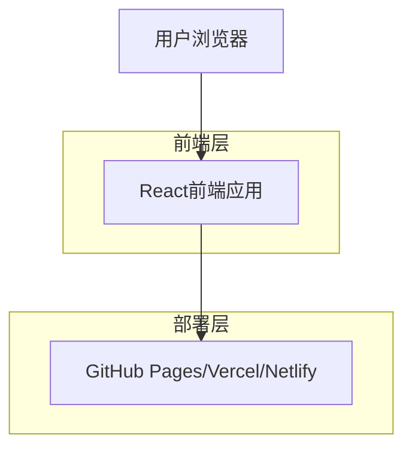

## 1. 架构设计



## 2. 技术描述

- **前端**: React@18 + TypeScript + TailwindCSS@3 + Vite
- **初始化工具**: vite-init
- **动画库**: Framer Motion（页面动画和交互效果）
- **图标库**: Lucide React
- **后端**: 无（纯静态站点）
- **部署**: 静态托管（GitHub Pages/Vercel/Netlify）

## 3. 路由定义

| 路由 | 用途 |
|------|------|
| / | 首页，单页应用展示所有内容模块 |

## 4. 组件结构

### 4.1 页面组件

```typescript
// App.tsx - 主应用组件
interface AppProps {
  // 无特殊props，配置通过常量文件管理
}

// 各模块组件
interface HeroSectionProps {
  name: string;
  title: string;
  description: string;
  avatarUrl: string;
}

interface AboutSectionProps {
  bio: string;
  education: EducationItem[];
  experience: ExperienceItem[];
}

interface SkillsSectionProps {
  skills: SkillCategory[];
}

interface ProjectsSectionProps {
  projects: ProjectItem[];
}

interface ContactSectionProps {
  email: string;
  socialLinks: SocialLink[];
}
```

### 4.2 类型定义

```typescript
// types/index.ts

interface EducationItem {
  id: string;
  school: string;
  degree: string;
  field: string;
  startDate: string;
  endDate: string;
  description?: string;
}

interface ExperienceItem {
  id: string;
  company: string;
  position: string;
  startDate: string;
  endDate: string;
  description: string;
}

interface Skill {
  name: string;
  level: number; // 0-100
  icon?: string;
}

interface SkillCategory {
  category: string;
  skills: Skill[];
}

interface ProjectItem {
  id: string;
  title: string;
  description: string;
  imageUrl: string;
  technologies: string[];
  demoUrl?: string;
  repoUrl?: string;
}

interface SocialLink {
  platform: string;
  url: string;
  icon: string;
}
```

## 5. 项目文件结构

```
src/
├── components/
│   ├── sections/
│   │   ├── HeroSection.tsx
│   │   ├── AboutSection.tsx
│   │   ├── SkillsSection.tsx
│   │   ├── ProjectsSection.tsx
│   │   └── ContactSection.tsx
│   ├── ui/
│   │   ├── Button.tsx
│   │   ├── Card.tsx
│   │   ├── ProgressBar.tsx
│   │   └── Timeline.tsx
│   └── layout/
│       ├── Navbar.tsx
│       ├── Footer.tsx
│       └── Container.tsx
├── hooks/
│   ├── useScrollAnimation.ts
│   └── useActiveSection.ts
├── types/
│   └── index.ts
├── data/
│   └── profile.ts          # 个人资料配置文件
├── styles/
│   └── globals.css
├── utils/
│   └── animations.ts
└── App.tsx
```

## 6. 依赖列表

```json
{
  "dependencies": {
    "react": "^18.2.0",
    "react-dom": "^18.2.0",
    "framer-motion": "^11.0.0",
    "lucide-react": "^0.300.0"
  },
  "devDependencies": {
    "@types/react": "^18.2.0",
    "@types/react-dom": "^18.2.0",
    "@vitejs/plugin-react": "^4.2.0",
    "autoprefixer": "^10.4.0",
    "postcss": "^8.4.0",
    "tailwindcss": "^3.4.0",
    "typescript": "^5.3.0",
    "vite": "^5.0.0"
  }
}
```

## 7. 配置文件

### 7.1 Tailwind 配置

```javascript
// tailwind.config.js
module.exports = {
  content: ['./index.html', './src/**/*.{js,ts,jsx,tsx}'],
  theme: {
    extend: {
      colors: {
        primary: '#e94560',
        secondary: '#16213e',
        dark: '#1a1a2e',
        accent: '#0f3460',
      },
      fontFamily: {
        sans: ['Inter', 'system-ui', 'sans-serif'],
      },
    },
  },
  plugins: [],
};
```

### 7.2 个人资料配置

```typescript
// src/data/profile.ts
export const profileData = {
  name: '张三',
  title: '全栈开发工程师',
  description: '热爱技术，专注于创造优雅的用户体验',
  avatar: '/avatar.jpg',
  email: 'zhangsan@example.com',
  social: [
    { platform: 'GitHub', url: 'https://github.com/zhangsan', icon: 'Github' },
    { platform: 'LinkedIn', url: 'https://linkedin.com/in/zhangsan', icon: 'Linkedin' },
  ],
  about: {
    bio: '5年开发经验...',
    education: [...],
    experience: [...],
  },
  skills: [...],
  projects: [...],
};
```
